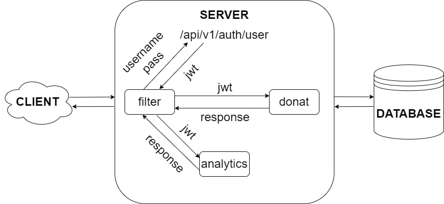

# Донаты для сримеров "Альфа Стрим"

Перед запуском склонируйте проект:
```
git clone https://github.com/auplt/Challenge2022.git
```

## Инициализация проекта
### Сервер
- Исходный код в папке server
- Стек технологий: Spring (Spring Boot, Spring Security), PostgreSQL
- Для запуска сервера вам понадобятся как PostgreSQL, так и Java 18.
Итак, убедитесь, что вы их установили
- Настройте файл application.properties (поменяйте на свой логи и пароль от PostgreSQL)
- Для запуска необходимо выполнить команды:
```
maven install
java -jar jarName.jar
```

### Клиент
- Исходный код в папке client
- Стек технологий: ReactTS
- Для запуска понадобится NodeJS
- Сlient install:
```
cd client
npm install
```
- set up dev proxy:
in file client/src/setupProxy.js change target to you server IP
use nginx to setup proxy in production

## Архитектура

